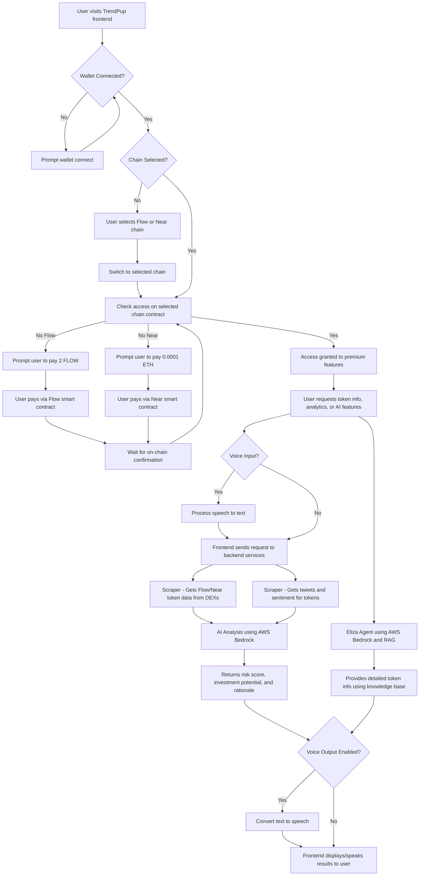

# TrendPup - Multi-Chain AI Memecoin Intelligence

**Advanced memecoin intelligence system for Flow and Near protocols with voice-enabled AI interaction.**

## Supported Chains

- **Flow EVM Testnet** (Chain ID: 545) - Subscription: 2 FLOW
- **Near Aurora Testnet** (Chain ID: 1313161555) - Subscription: 0.0001 ETH

## Key Features

- 🤖 **AI-Powered Analysis** - AWS Bedrock integration for sophisticated token evaluation
- 🎤 **Voice Interface** - Natural speech input and high-quality voice output
- 🔗 **Multi-Chain Support** - Unified experience across Flow and Near ecosystems  
- 📊 **Real-Time Data** - Live token tracking and social sentiment analysis
- 🛡️ **Scam Detection** - Advanced filtering to identify rugpulls and fake projects
- 💬 **Eliza AI Agent** - Conversational AI with retrieval-augmented generation
- 🔄 **Dynamic Chain Switching** - Seamless switching between supported networks

## Problem It Solves

An **AI-powered early detection system** specifically designed for **Flow and Near Protocol meme coins**, identifying **promising tokens before significant price movement** across multiple innovative blockchain ecosystems.

Our **profit-sharing business model** aligns incentives perfectly with users - **we only earn when our users profit from our signals**.

## What Users Can Use It For

Our AI-powered system helps users:

- **Discover high-potential Flow and Near meme coins early** - before major price surges, giving retail investors a critical edge across multiple blockchains.
- **Automate multi-chain token monitoring** - eliminating the need to manually scan Telegram, Twitter, DEXs, and trackers across multiple platforms and chains.
- **Filter scams and rugpulls** - using behavioral and on-chain analysis to detect red flags on both Flow and Near, making trading safer.
- **Identify real community momentum** - distinguishing organic growth from paid shills or bot activity across ecosystems.
- **Level the playing field** - by reducing information asymmetry traditionally exploited by insiders, whales, and snipers.
- **Enter earlier for maximum ROI** - ensuring users don't miss the small window of explosive growth most meme coins experience early on.
- **Voice-enabled AI interaction** - use natural speech to query markets, get analysis, and receive trading insights hands-free.

## How It Improves the Status Quo

Traditional methods of discovering meme coins on Flow and Near have major flaws:

- Discovering tokens **after** the pump = missed profits  
- **Manual research** across multiple chains wastes time and is error-prone  
- Hard to tell a **genuine project** from a scam across different ecosystems  
- **Insiders and bots** always move first on every chain  
- Most tools can't separate **real hype from fake** across Flow and Near  
- Retail traders often miss the **early-entry sweet spot** in emerging ecosystems  
- **No unified view** of opportunities across multiple innovative blockchains

Our system solves all of this — and better yet, **we only profit when you do**.

## TrendPup Project Architecture Flow

**Component Breakdown**

- **Hosting:**  
  All services are hosted on GCP (Google Cloud Platform) for reliability and scalability.

- **Frontend (Next.js):**  
  Handles multi-chain wallet connection, access control, and user interface.  
  Supports both Flow EVM and Near Aurora testnets with dynamic chain switching.  
  Features voice input/output capabilities for hands-free AI interaction.

- **Scraper:**  
  Scrapes DEXs for Flow and Near token data across multiple protocols.  
  Scrapes Twitter for token-related tweets and sentiment analysis.  
  Monitors both ecosystems for emerging opportunities.

- **AI Analysis (AWS Bedrock):**  
  Reads tweets and multi-chain token data.  
  Determines risk score, investment potential, and provides rationale.  
  Specialized analysis for Flow and Near ecosystem dynamics.

- **Eliza Agent (AWS Bedrock + RAG):**  
  Advanced AI agent with Retrieval-Augmented Generation.  
  Answers user queries with the latest token data and in-depth analysis.  
  Supports natural voice interaction and text-to-speech responses.

- **Voice Interface:**  
  Speech recognition for natural voice commands and queries.  
  High-quality text-to-speech with customizable voice selection.  
  Hands-free trading insights and market analysis.

**Summary:**  
This system ensures only paid users (on Flow or Near) can access premium features. The backend aggregates real-time blockchain and social data from both ecosystems, then leverages advanced AI (AWS Bedrock) for investment analysis and conversational intelligence, all orchestrated through a modern Next.js frontend with voice-enabled interaction capabilities.

---

**TrendPup** - Democratizing memecoin intelligence across Flow and Near ecosystems with cutting-edge AI and voice interaction.
