# TrendPup 🐕 - AI Memecoin Investment Assistant

**Advanced AI-powered memecoin intelligence system for Solana and Ethereum blockchains with real-time trading capabilities, wallet integration, and comprehensive investment analysis.**

## Supported Chains & Networks

- **Solana (SOL)** - Chain ID: 501 - Native SOL and SPL token support
- **Ethereum (ETH)** - Chain ID: 1 - Native ETH and ERC-20 token support
- **Multi-Chain Wallet Operations** - Cross-chain balance checking and trading
- **OKX DEX Integration** - Professional-grade trading infrastructure

## Key Features

- 🤖 **AI-Powered Investment Advice** - Provides specific memecoin recommendations and trading strategies
- 💰 **Financial Advisory Services** - Authorized to give investment advice and portfolio recommendations
- 🔗 **Multi-Chain Support** - Native Solana (SOL) and Ethereum (ETH) blockchain integration
- � **Weallet Balance Checking** - Real-time balance queries for any wallet address
- � **Live Trading Execution** - Execute swaps and trades directly through the platform
- 🌉 **Cross-Chain Bridging** - Bridge tokens between Solana and Ethereum
- 📊 **Real-Time Market Data** - Live token prices, liquidity, and trading pairs
- 🔍 **Advanced Token Search** - Find tokens by name, symbol, or contract address
- �️ **Seucurity Analysis** - Comprehensive risk assessment and scam detection
- 💬 **Conversational AI** - Natural language interaction with dog-themed personality
- 🌐 **Google Search Integration** - Enhanced market intelligence and news analysis
- ⚡ **MCP Protocol** - Professional-grade Model Context Protocol integration for okx dex api

## Current Capabilities & Functions

### 🔧 **OKX DEX MCP Tools & Functions**

**DEX Operations:**
- `get_tokens(chainId, searchTerm)` - List supported tokens for Solana (501) or Ethereum (1)
- `get_liquidity(chainId)` - Get available liquidity pools for trading
- `get_chain_data(chainId)` - Retrieve chain-specific configuration and data
- `get_quote(chainId, fromToken, toToken, amount)` - Get swap quotes for token pairs
- `get_swap_data(chainId, fromToken, toToken, amount, walletAddress)` - Get transaction data for swaps
- `execute_swap(chainId, fromToken, toToken, amount, privateKey)` - Execute token swaps

**Wallet Operations:**
- `get_wallet_balance(walletAddress, chainId, tokenAddress?)` - Check wallet balances
  - Native tokens: ETH balance on Ethereum, SOL balance on Solana
  - Specific tokens: Any ERC-20 on Ethereum, any SPL token on Solana
  - Auto-detects chain from wallet address format
- `store_wallet_credentials(privateKey, chainId)` - Securely store wallet credentials for trading

**Advanced Search:**
- `search_trading_pairs(pairQuery, chainId)` - Find trading pairs (e.g., "REKT/ETH", "PEPE/USDT")
- `find_token_by_name(tokenQuery, chainId, searchType)` - Search tokens by name/symbol
  - Search types: "exact", "contains", "starts_with"

**Cross-Chain Bridge Operations:**
- `get_supported_tokens(chainId?)` - List bridgeable tokens
- `get_supported_bridges()` - Available bridge protocols
- `get_bridge_token_pairs(fromChainId, toChainId)` - Bridge token pairs between chains
- `get_cross_chain_quote(fromChainId, toChainId, fromToken, toToken, amount)` - Cross-chain quotes
- `build_cross_chain_swap(fromChainId, toChainId, fromToken, toToken, amount)` - Execute cross-chain swaps

### 🤖 **AI Agent Architecture**

**Multi-Agent System:**
1. **README Context Agent** - Provides project context and detects crypto queries
2. **MCP Agent** - Handles live blockchain data and trading operations  
3. **Google Search Agent** - Provides market intelligence and news analysis
4. **Root Agent (TrendPup)** - Coordinates all agents and provides final recommendations

**Agent Flow:**
```
User Query → README Context → [MCP + Google Search in parallel] → Combined Analysis & Recommendations
```

### 💡 **Investment Advisory Features**

**Financial Advice Authorization:**
- ✅ Provides specific memecoin investment recommendations
- ✅ Gives clear BUY/SELL/HOLD advice with reasoning
- ✅ Suggests portfolio allocation and position sizing
- ✅ Analyzes risk levels and entry strategies
- ✅ Recommends 2-3 specific tokens with contract addresses

**Risk Assessment Framework:**
- Liquidity analysis and slippage risk evaluation
- Token age and security assessment
- Community sentiment and authenticity verification
- Contract security and audit status review
- Market volatility and manipulation detection

### 🔍 **Supported Wallet Address Formats**

**Ethereum Addresses:**
- Format: `0x` prefix + 40 hexadecimal characters
- Example: `0xF977814e90dA44bFA03b6295A0616a897441aceC`
- Chain ID: "1" for mainnet

**Solana Addresses:**
- Format: Base58 encoded, 32-44 characters
- Example: `52C9T2T7JRojtxumYnYZhyUmrN7kqzvCLc4Ksvjk7TxD`
- Chain ID: "501" for mainnet

## Our Memecoin Analysis Methodology

**TrendPup's AI-Powered Fundamental Analysis Framework**

Our system employs a comprehensive **5-Factor Risk Assessment Model** that prioritizes capital preservation while identifying legitimate opportunities. Here's how we analyze every memecoin:

### 🚨 Critical Risk Factors We Assess

**1. LIQUIDITY HEALTH** 🏊‍♂️
- **Pool Size Analysis**: Tokens with <$50K liquidity flagged as HIGH RISK
- **Slippage Risk Assessment**: Low liquidity = difficulty selling without major price impact
- **Exit Strategy Viability**: Can you actually get your money out?
- **Volume-to-Liquidity Ratio**: High ratios (>5x) suggest potential manipulation

**2. AGE-BASED SECURITY** ⏰
- **Brand New (<24 hours)**: EXTREME RUG PULL RISK
- **Very New (<7 days)**: HIGH RISK - most rug pulls occur in this phase
- **Young (<30 days)**: MODERATE RISK - still establishing legitimacy
- **Established (>90 days)**: LOWER RISK - survived initial high-risk phases

**3. VOLATILITY PATTERNS** 📈📉
- **Extreme Volatility (>100% daily)**: Possible pump/dump scheme indicators
- **Manipulation Detection**: Sudden coordinated price movements
- **Healthy Volatility Range**: 20-50% daily for memecoins is normal
- **Technical Analysis**: Support/resistance level identification

**4. CONTRACT SECURITY** 🔒
- **Ownership Status**: Renounced contracts provide higher security
- **Hidden Functions**: Detection of honeypot, pause, or blacklist capabilities
- **Mint Authority**: Analysis of unlimited token creation risks
- **Audit Status**: Third-party security review verification

**5. COMMUNITY AUTHENTICITY** 👥
- **Organic Growth Verification**: Real engagement vs. bot activity detection
- **Developer Transparency**: Public team vs. anonymous developer assessment
- **Social Sentiment Analysis**: Genuine excitement vs. coordinated campaigns
- **Holder Distribution**: Concentration risk in few wallets

### 📊 Risk Assessment Framework

**Risk Levels (1-10 Scale):**
- **1-3: LOW RISK** - Established tokens with solid fundamentals
- **4-6: MEDIUM RISK** - Some concerns but manageable with proper position sizing
- **7-8: HIGH RISK** - Multiple red flags, very small positions only
- **9-10: EXTREME RISK** - Avoid entirely or exit immediately

**Potential Levels (1-10 Scale):**
- **8-10: HIGH POTENTIAL** - Strong fundamentals + compelling narrative + authentic community
- **5-7: MEDIUM POTENTIAL** - Some positive factors with moderate upside
- **1-4: LOW POTENTIAL** - Limited catalysts or declining metrics

### 🛡️ Position Sizing Recommendations

Our AI provides specific portfolio allocation guidance:
- **Low Risk (1-3)**: Up to 5-10% of portfolio allocation
- **Medium Risk (4-6)**: 2-5% of portfolio maximum
- **High Risk (7-8)**: 1-2% of portfolio maximum
- **Extreme Risk (9-10)**: Avoid entirely or <1% speculation only

### ⚠️ Automatic Red Flag Detection

Our system immediately warns users about:
- Zero or unknown liquidity data
- Daily price changes exceeding 200%
- Unverified or suspicious contract information
- Anonymous teams making unrealistic promises
- Sudden coordinated social media campaign patterns

### 🎯 Investment Philosophy

**Capital Preservation First**: We prioritize avoiding total loss over chasing maximum gains. Our philosophy: "Better to miss a 10x than lose everything on a rug pull."

**Our Analysis Helps Users:**
- Avoid total loss scenarios through comprehensive risk assessment
- Size positions appropriately based on individual risk profiles
- Identify genuine opportunities with long-term staying power
- Plan exit strategies before entering positions
- Make data-driven decisions rather than emotional trades

## Problem It Solves

An **AI-powered memecoin investment assistant** that provides **specific investment recommendations** and **executes trades** across **Solana and Ethereum** ecosystems, combining live blockchain data with comprehensive market intelligence.

Our **professional-grade trading platform** offers **direct financial advice** and **automated trading execution**, democratizing access to institutional-level memecoin analysis and trading capabilities.

## What Users Can Use It For

### 💰 **Investment & Trading**
- **Get specific memecoin recommendations** - TrendPup provides 2-3 specific token suggestions with contract addresses, risk levels, and entry strategies
- **Execute trades directly** - Swap tokens, bridge between chains, and manage positions through integrated OKX DEX
- **Check wallet balances** - Real-time balance queries for any Ethereum or Solana wallet address
- **Portfolio management** - Position sizing recommendations and risk assessment for optimal allocation

### 🔍 **Research & Analysis**
- **Multi-chain token discovery** - Find tokens across Solana and Ethereum with advanced search capabilities
- **Live market data** - Real-time prices, liquidity, trading pairs, and volume analysis
- **Security assessment** - Comprehensive risk analysis including contract audits and scam detection
- **Market intelligence** - Combined blockchain data with Google Search for complete market context

### 🤖 **AI-Powered Features**
- **Conversational interface** - Natural language interaction with dog-themed personality
- **Financial advisory** - Authorized to provide investment advice and trading recommendations
- **Multi-agent analysis** - Combines technical blockchain data with market sentiment and news
- **Automated research** - Parallel data gathering from MCP tools and Google Search for comprehensive analysis

### 🔗 **Cross-Chain Operations**
- **Bridge tokens** - Move assets between Solana and Ethereum seamlessly
- **Multi-chain wallet support** - Manage wallets and check balances across both ecosystems
- **Chain-specific insights** - Specialized analysis for Solana SPL tokens and Ethereum ERC-20 tokens

## AI Analysis Pipeline

```mermaid
flowchart TB
    subgraph "User Interface"
        A[User Query]
        B[Natural Language Input]
    end
    
    subgraph "AI Agent System"
        C[README Context Agent]
        D[MCP Agent]
        E[Google Search Agent]
        F[Root Agent - TrendPup 🐕]
    end
    
    subgraph "Data Sources"
        G[OKX MCP Server]
        H[Solana Blockchain]
        I[Ethereum Blockchain]
        J[Google Search API]
        K[README Documentation]
    end
    
    subgraph "MCP Tools"
        L[Wallet Balance Checker]
        M[Token Search Engine]
        N[DEX Trading Tools]
        O[Cross-Chain Bridge]
        P[Liquidity Analyzer]
    end
    
    subgraph "Output Generation"
        Q[Investment Recommendations]
        R[Risk Assessment]
        S[Trade Execution]
        T[Market Intelligence]
    end
    
    A --> C
    B --> C
    C --> D
    C --> E
    D --> G
    E --> J
    C --> K
    
    G --> L
    G --> M
    G --> N
    G --> O
    G --> P
    
    H --> G
    I --> G
    
    D --> F
    E --> F
    L --> Q
    M --> R
    N --> S
    P --> T
    
    F --> Q
    F --> R
    F --> S
    F --> T
    
    style F fill:#ff6b35
    style G fill:#9333ea
    style Q fill:#32cd32
    style S fill:#32cd32
```



## How It Improves the Status Quo

Traditional memecoin research and trading methods have major limitations:

### ❌ **Traditional Problems:**
- **No direct investment advice** - Most tools avoid giving specific recommendations
- **Manual research required** - Users must analyze tokens themselves across multiple platforms
- **Fragmented data sources** - DEX data, social sentiment, and news scattered across different tools
- **No trading execution** - Research tools don't offer direct trading capabilities
- **Single-chain focus** - Most tools only support one blockchain ecosystem
- **Expensive subscriptions** - Professional tools cost $100+ monthly with limited features
- **No wallet integration** - Can't check balances or execute trades directly
- **Late discovery** - Find tokens after significant price movement

### ✅ **TrendPup Solutions:**
- **Direct financial advice** - Provides specific BUY/SELL/HOLD recommendations with reasoning
- **Automated research** - AI agents gather and analyze data from multiple sources simultaneously
- **Unified intelligence** - Combines MCP blockchain data with Google Search market intelligence
- **Integrated trading** - Execute swaps, bridges, and trades directly through the platform
- **Multi-chain support** - Native Solana and Ethereum integration with cross-chain capabilities
- **Professional-grade free access** - Institutional-level analysis without subscription barriers
- **Complete wallet integration** - Check balances, store credentials, and execute trades seamlessly
- **Early detection** - AI-powered analysis identifies opportunities before mainstream discovery

## Market Opportunity Analysis


## TrendPup System Architecture


### **Component Architecture:**

**Frontend Layer:**
- Natural language interface for user queries
- Multi-chain wallet integration (Solana & Ethereum)
- Real-time balance display and trading interface

**AI Agent Layer:**
- **Root Agent (TrendPup)** - Coordinates all operations and provides final recommendations
- **README Context Agent** - Provides up-to-date project context and capability information
- **MCP Agent** - Handles live blockchain data and trading operations
- **Google Search Agent** - Provides market intelligence and news analysis

**MCP Integration Layer:**
- **OKX MCP Server** - Professional-grade DEX and bridge operations
- **Solana RPC** - Native SOL and SPL token operations (Chain ID: 501)
- **Ethereum RPC** - Native ETH and ERC-20 token operations (Chain ID: 1)

**Data Sources:**
- Live blockchain data from Solana and Ethereum networks
- Google Search API for market news and sentiment
- README documentation for current capabilities and context

## Technology Stack Overview


**Component Breakdown**

- **AI Agent Framework (Google ADK):**  
  Multi-agent system using Google's Agent Development Kit.  
  Gemini 2.5 Pro and flash models for advanced natural language processing.  
  Coordinated agent workflow for comprehensive analysis.  
  Retrieval-Augmented Generation with README context.

- **MCP Integration (Model Context Protocol):**  
  Professional-grade protocol for AI-blockchain interaction.  
  TypeScript-based OKX MCP server implementation.  
  Server-Sent Events (SSE) transport for real-time communication.  
  Standardized tool calling interface for blockchain operations.

- **Multi-Chain Blockchain Support:**  
  **Solana Integration** - Chain ID 501, native SOL and SPL tokens.  
  **Ethereum Integration** - Chain ID 1, native ETH and ERC-20 tokens.  
  **Sepolia Testnet** - Chain ID for testing and development.  
  Auto-detection of chain from wallet address format.

- **Trading Infrastructure:**  
  **OKX DEX Integration** - Professional-grade decentralized exchange.  
  **Cross-Chain Bridges** - Seamless asset movement between chains.  
  **Wallet Management** - Secure credential storage and balance checking.  
  **Trade Execution** - Direct swap and bridge transaction execution.

- **Data Intelligence Layer:**  
  **Google Search Integration** - Real-time market news and sentiment.  
  **Live Blockchain Data** - Direct RPC connections to Solana and Ethereum.  
  **README Context** - Up-to-date project capabilities and documentation.  
  **Market Intelligence** - Combined technical and fundamental analysis.

- **Financial Advisory System:**  
  **Investment Recommendations** - Specific token suggestions with reasoning.  
  **Risk Assessment** - Comprehensive security and volatility analysis.  
  **Portfolio Guidance** - Position sizing and allocation recommendations.  
  **Trading Strategies** - Entry points, exit strategies, and risk management.

- **Security & Wallet Features:**  
  **Multi-Wallet Support** - Ethereum (0x format) and Solana (Base58 format).  
  **Secure Credential Management** - Temporary in-memory storage during sessions.  
  **Balance Verification** - Real-time wallet balance checking across chains.  
  **Transaction Security** - Validated private key formats and secure execution.

## Feature Comparison Matrix

```mermaid
graph TB
    subgraph "TrendPup Features"
        A[✅ AI Analysis]
        B[✅ Voice Interface]
        C[✅ Scam Detection]
        D[✅ Move Contract Analysis]
        E[✅ Real-time Data]
        F[✅ 1 APT Fair Pricing]
        G[✅ Multi-wallet Support]
        H[✅ Early Detection]
    end
    
    subgraph "Traditional Tools"
        I[❌ Manual Research]
        J[❌ Text Only]
        K[❌ Basic Filtering]
    end
```




### Architecture Overview

**Backend Services (Node.js + Python Stack):**

- API server processes requests and coordinates data analysis
- Python AI agent provides intelligent token analysis and insights
- Web scrapers collect real-time data from Solana DEXs and social media

**AI Infrastructure:**

- Modern AI models for advanced analysis and pattern recognition
- Speech recognition for voice input processing
- Text-to-speech synthesis for voice responses

**Data Integration:**

- Real-time scraping of Solana DEX data and SPL token metrics
- Social sentiment analysis from Twitter, Telegram, and other platforms
- On-chain analytics from Solana blockchain data


## Why TrendPup vs. Traditional Tools?

```mermaid
graph LR
    subgraph "TrendPup Advantages"
        A[✅ Direct Financial Advice]
        B[✅ Multi-Chain Support] 
        C[✅ Integrated Trading]
        D[✅ AI-Powered Analysis]
        E[✅ Real-time Execution]
        F[✅ Wallet Integration]
        G[✅ MCP Protocol]
        H[✅ Cross-Chain Bridges]
    end
    
    subgraph "Competitor Limitations"
        I[❌ No Investment Advice]
        J[❌ Single Chain Only]
        K[❌ Research Only]
        L[❌ Manual Analysis]
        M[❌ No Trading Features]
        N[❌ External Wallets]
        O[❌ Proprietary APIs]
        P[❌ No Bridge Support]
    end
    
    style A fill:#32cd32
    style B fill:#32cd32
    style C fill:#32cd32
    style D fill:#32cd32
    style E fill:#32cd32
    style F fill:#32cd32
    style G fill:#32cd32
    style H fill:#32cd32
    
    style I fill:#ff4444
    style J fill:#ff4444
    style K fill:#ff4444
    style L fill:#ff4444
    style M fill:#ff4444
    style N fill:#ff4444
    style O fill:#ff4444
    style P fill:#ff4444
```



## Summary

**TrendPup 🐕** is an advanced AI-powered memecoin investment assistant that provides **direct financial advice** and **trading execution** across **Solana and Ethereum** ecosystems. 

### **Key Differentiators:**

🤖 **AI Investment Advisory** - Provides specific BUY/SELL/HOLD recommendations with detailed reasoning  
🔗 **Multi-Chain Native** - Seamless Solana (SOL) and Ethereum (ETH) integration with cross-chain bridges  
💳 **Integrated Trading** - Execute swaps, check balances, and manage positions directly through the platform  
🛠️ **MCP Protocol** - Professional-grade Model Context Protocol for reliable blockchain interactions  
🌐 **Comprehensive Intelligence** - Combines live blockchain data with Google Search market analysis  
🐕 **Conversational Interface** - Natural language interaction with dog-themed personality and financial expertise  

The platform leverages Google ADK's multi-agent framework, OKX's professional trading infrastructure, and real-time market intelligence to provide institutional-level memecoin analysis and trading capabilities to retail users.

---

## Success Metrics


*TrendPup - AI-powered Solana memecoin intelligence, now with voice interaction capabilities.*

