# TrendPup 🐕 - AI Memecoin Investment Assistant

**Advanced AI-powered memecoin intelligence system for Sonic blockchain with real-time sentiment analysis, comprehensive risk assessment, and professional investment recommendations.**

## Supported Chains & Networks

- **Sonic Blockchain** - Chain ID: 14601 - Native S token and ERC-20 support
- **DexScreener Integration** - Real-time token data from Sonic DEX pairs
- **EVM Compatibility** - Full Ethereum Virtual Machine compatibility with optimized transaction speeds
- **Multi-Wallet Support** - Native integration with MetaMask and other EVM-compatible wallets

## Key Features

- 🤖 **AI-Powered Investment Analysis** - Google Gemini 2.5 Flash models provide comprehensive memecoin risk assessment
- � **Real-Time Twitter Intelligence** - Automated scraping and sentiment analysis of token-specific social discussions
- � **Advanced Risk Assessment** - 5-factor risk model: liquidity, age, volatility, volume, and community sentiment
- 📊 **Live Market Data** - Real-time token prices, volume, market cap, and age from Sonic DexScreener
- 🛡️ **Comprehensive Security Analysis** - Multi-dimensional risk scoring with AI-generated reasoning
- 💬 **Professional Investment Recommendations** - Specific risk/potential scores with detailed rationale
- 🎯 **Early Detection System** - Identifies emerging tokens before mainstream discovery
- 🖥️ **Desktop Interface** - Professional desktop-style window management system
- 🔊 **Voice Interface** - Speech-to-text input and text-to-speech responses for hands-free interaction

## Current System Architecture

### 🔧 **Current System Architecture**

**Multi-Agent AI System:**
- **Google ADK Framework** - Python-based AI agents using Google's Agent Development Kit
- **Root Agent (TrendPup)** - Coordinates all operations and provides final recommendations
- **Sonic MCP Integration** - Professional-grade Model Context Protocol server for blockchain operations
- **Real-time Data Processing** - Combines DexScreener monitoring with Twitter sentiment analysis

**Blockchain Integration:**
- **Sonic MCP Server** - Full TypeScript implementation with comprehensive blockchain tools
- **Balance & Token Operations** - Real-time wallet balance checking and token information
- **Chain Queries** - Live blockchain data through RPC connections to Sonic Testnet
- **EVM Compatibility** - Standard Ethereum-style operations and address formats

**Data Collection & Analysis Pipeline:**
- **Token Data Collection** - Automated DexScreener scraping for Sonic chain tokens using Playwright
- **Twitter Intelligence Engine** - Real-time collection of token-specific tweets and engagement metrics
- **AI Analysis System** - Google Gemini 2.5 Flash models for sentiment analysis and risk assessment
- **Coordinated Processing** - Intelligent analysis coordination waiting for sufficient data

**Professional Interface:**
- **Next.js React Frontend** - Desktop-style window management interface
- **Real-time Updates** - Live data refresh and multi-window token research capabilities
- **Risk Assessment Display** - Visual risk vs. potential scoring with detailed AI rationale
- **API Integration** - REST endpoints serving analyzed data from backend services

## Our Memecoin Analysis Methodology

**TrendPup's AI-Powered Fundamental Analysis Framework**

Our system employs a comprehensive **5-Factor Risk Assessment Model** that prioritizes capital preservation while identifying legitimate opportunities. Here's how we analyze every memecoin:

### 🚨 Critical Risk Factors We Assess

**1. LIQUIDITY HEALTH** 🏊‍♂️
- **Pool Size Analysis**: Tokens with <$50K liquidity flagged as HIGH RISK
- **Slippage Risk Assessment**: Low liquidity = difficulty selling without major price impact
- **Exit Strategy Viability**: Can you actually get your money out?
- **Volume-to-Liquidity Ratio**: High ratios (>5x) suggest potential manipulation

**2. AGE-BASED SECURITY** ⏰
- **Brand New (<24 hours)**: EXTREME RUG PULL RISK
- **Very New (<7 days)**: HIGH RISK - most rug pulls occur in this phase
- **Young (<30 days)**: MODERATE RISK - still establishing legitimacy
- **Established (>90 days)**: LOWER RISK - survived initial high-risk phases

**3. VOLATILITY PATTERNS** 📈📉
- **Extreme Volatility (>100% daily)**: Possible pump/dump scheme indicators
- **Manipulation Detection**: Sudden coordinated price movements
- **Healthy Volatility Range**: 20-50% daily for memecoins is normal
- **Technical Analysis**: Support/resistance level identification

**4. CONTRACT SECURITY** 🔒
- **Ownership Status**: Renounced contracts provide higher security
- **Hidden Functions**: Detection of honeypot, pause, or blacklist capabilities
- **Mint Authority**: Analysis of unlimited token creation risks
- **Audit Status**: Third-party security review verification

**5. COMMUNITY AUTHENTICITY** 👥
- **Real Twitter Activity Analysis**: Direct scraping and analysis of actual tweets using $TOKEN searches
- **Engagement Quality Assessment**: Likes, retweets, and replies analysis for authenticity
- **Organic Growth Verification**: Real engagement vs. bot activity detection through tweet patterns
- **Developer Transparency**: Public team vs. anonymous developer assessment
- **Advanced Sentiment Scoring**: AI-powered analysis of tweet content sentiment and market mood
- **Holder Distribution**: Concentration risk in few wallets
- **Community Activity Levels**: High (5+ tweets), Medium (2-5 tweets), Low (<2 tweets)

### 📊 Risk Assessment Framework

**Risk Levels (1-10 Scale):**
- **1-3: LOW RISK** - Established tokens with solid fundamentals
- **4-6: MEDIUM RISK** - Some concerns but manageable with proper position sizing
- **7-8: HIGH RISK** - Multiple red flags, very small positions only
- **9-10: EXTREME RISK** - Avoid entirely or exit immediately

**Potential Levels (1-10 Scale):**
- **8-10: HIGH POTENTIAL** - Strong fundamentals + compelling narrative + authentic community
- **5-7: MEDIUM POTENTIAL** - Some positive factors with moderate upside
- **1-4: LOW POTENTIAL** - Limited catalysts or declining metrics

### 🛡️ Position Sizing Recommendations

Our AI provides specific portfolio allocation guidance:
- **Low Risk (1-3)**: Up to 5-10% of portfolio allocation
- **Medium Risk (4-6)**: 2-5% of portfolio maximum
- **High Risk (7-8)**: 1-2% of portfolio maximum
- **Extreme Risk (9-10)**: Avoid entirely or <1% speculation only

### ⚠️ Automatic Red Flag Detection

Our system immediately warns users about:
- Zero or unknown liquidity data
- Daily price changes exceeding 200%
- Unverified or suspicious contract information
- Anonymous teams making unrealistic promises
- Sudden coordinated social media campaign patterns

### 🎯 Investment Philosophy

**Capital Preservation First**: We prioritize avoiding total loss over chasing maximum gains. Our philosophy: "Better to miss a 10x than lose everything on a rug pull."

**Our Analysis Helps Users:**
- Avoid total loss scenarios through comprehensive risk assessment
- Size positions appropriately based on individual risk profiles
- Identify genuine opportunities with long-term staying power
- Plan exit strategies before entering positions
- Make data-driven decisions rather than emotional trades

## Problem It Solves

An **AI-powered memecoin intelligence system** for the **Sonic blockchain** that provides **comprehensive risk assessment** and **investment analysis** through **real-time sentiment analysis** and **advanced AI evaluation**.

Our **professional-grade analysis platform** delivers **data-driven investment insights** for Sonic ecosystem tokens, combining live blockchain data with Twitter sentiment analysis to provide **institutional-level memecoin research** with detailed reasoning and risk assessment on the high-performance Sonic network.

## What Users Can Use It For

### � **Investment Research & Analysis**
- **Comprehensive token analysis** - TrendPup provides detailed risk/potential scores with AI-generated rationale for Sonic tokens
- **Real-time market data** - Live prices, volume, liquidity, and age analysis from DexScreener for Sonic pairs
- **Social sentiment analysis** - Twitter intelligence gathering and sentiment scoring for token communities
- **Risk assessment** - Multi-factor analysis including liquidity, age, volatility, and social sentiment

### 🔍 **Token Discovery & Intelligence**
- **Sonic ecosystem monitoring** - Automated discovery of new tokens on Sonic blockchain through DexScreener
- **Twitter intelligence** - Real-time collection and analysis of token-specific social media activity
- **AI-powered insights** - Google Gemini 2.5 Flash models provide detailed reasoning for investment recommendations
- **Professional interface** - Desktop-style window management for efficient token research and monitoring

### 🤖 **AI-Powered Features**
- **Advanced sentiment analysis** - Natural language processing of Twitter content for authentic community assessment
- **Investment rationale** - Detailed AI-generated explanations for each risk and potential score
- **Multi-factor scoring** - Comprehensive evaluation combining technical and social indicators
- **Real-time updates** - Continuous monitoring and analysis of new tokens and sentiment changes

### 💎 **Premium Access System**
- **Sonic Network Integration** - Native payment system using Sonic blockchain smart contracts
- **Access Fee** - 1 SONIC token for premium analysis features and professional interface
- **Smart Contract Verification** - Automated access control through Sonic testnet smart contracts
- **Wallet Integration** - MetaMask and Rainbow Kit support for seamless premium payments
- **Contract Address** - `0xCa36dD890F987EDcE1D6D7C74Fb9df627c216BF6` on Sonic Testnet

## AI Analysis Pipeline

```mermaid
flowchart TB
    subgraph "User Interface"
        A[User Query]
        B[Natural Language Input]
    end
    
    subgraph "AI Agent System"
        C[README Context Agent]
        D[Sonic Network Agent]
        E[Twitter Scraper Engine]
        F[AI Sentiment Analyzer]
        G[Root Agent - TrendPup 🐕]
    end
    
    subgraph "Data Sources"
        H[Sonic Network]
        I[Sonic Testnet]
        J[EVM Compatible Chains]
        K[Twitter API/Scraper]
        L[README Documentation]
    end
    
    subgraph "Sonic Tools"
        M[Wallet Balance Checker]
        N[Token Search Engine]
        O[DEX Trading Tools]
        P[Cross-Chain Bridge]
        Q[Liquidity Analyzer]
        R[Tweet Sentiment Engine]
    end
    
    subgraph "Output Generation"
        S[Investment Recommendations]
        T[Risk Assessment]
        U[Trade Execution]
        V[Market Intelligence]
    end
    
    A --> C
    B --> C
    C --> D
    C --> E
    D --> H
    E --> K
    F --> G
    C --> L
    
    H --> M
    H --> N
    H --> O
    H --> P
    H --> Q
    K --> R
    
    I --> H
    J --> H
    
    D --> G
    E --> F
    F --> G
    M --> S
    N --> T
    O --> U
    Q --> V
    R --> S
    
    G --> S
    G --> T
    G --> U
    G --> V
    
    style G fill:#ff6b35
    style H fill:#9333ea
    style S fill:#32cd32
    style U fill:#32cd32
```

## How It Improves the Status Quo

Traditional memecoin research methods have major limitations:

### ❌ **Traditional Problems:**
- **Manual research required** - Users must analyze tokens themselves across multiple platforms
- **Fragmented data sources** - DEX data, social sentiment scattered across different tools
- **No comprehensive risk assessment** - Lack of integrated AI analysis for investment decisions
- **Single-factor analysis** - Most tools only examine price/volume without sentiment
- **No reasoning provided** - Charts and numbers without explanation of risk factors
- **Expensive subscriptions** - Professional tools cost $100+ monthly with limited features
- **Late discovery** - Find tokens after significant price movement
- **No sentiment intelligence** - Miss community authenticity and social momentum indicators

### ✅ **TrendPup Solutions:**
- **AI-powered comprehensive analysis** - Google Gemini 2.5 Flash provides detailed investment reasoning
- **Advanced Twitter Intelligence** - Real-time scraping and AI analysis of token-specific social sentiment
- **Automated research coordination** - AI agents gather and analyze data from multiple sources simultaneously
- **Unified intelligence** - Combines Sonic blockchain data with Twitter sentiment for complete picture
- **Multi-factor risk assessment** - Analyzes liquidity, age, volatility, volume, and social sentiment together
- **Sonic network focus** - Native Sonic integration with enhanced performance and EVM compatibility
- **Professional desktop interface** - Institutional-level analysis with intuitive window management
- **Detailed AI rationale** - Every score explained with comprehensive reasoning and market context
- **Early detection** - AI-powered analysis identifies opportunities before mainstream discovery
- **Premium access model** - Affordable 1 SONIC token fee for professional-grade analysis features

## Market Opportunity Analysis

## TrendPup System Architecture

### **Component Architecture:**

**Frontend Layer:**
- Natural language interface for user queries
- Multi-chain wallet integration (Sonic & EVM networks)
- Real-time balance display and trading interface

**AI Agent Layer:**
- **Root Agent (TrendPup)** - Coordinates all operations and provides final recommendations
- **README Context Agent** - Provides up-to-date project context and capability information
- **Sonic Network Agent** - Handles live blockchain data and trading operations on Sonic
- **Google Search Agent** - Provides market intelligence and news analysis

**Network Integration Layer:**
- **Sonic MCP Server** - Professional-grade DEX and bridge operations
- **Sonic RPC** - Native S and ERC-20 token operations (Chain ID: 14601)
- **EVM Compatible Networks** - Cross-chain operations with other EVM networks

**Data Sources:**
- Live blockchain data from Sonic and EVM networks
- Google Search API for market news and sentiment
- README documentation for current capabilities and context

## Technology Stack Overview

**Component Breakdown**

- **AI Agent Framework (Google ADK):**  
  Multi-agent system using Google's Agent Development Kit with Python agents.  
  Gemini 2.5 Flash models for advanced natural language processing and sentiment analysis.  
  Coordinated agent workflow combining blockchain data with Twitter intelligence.  
  Agent system integrates with MCP server for blockchain operations.

- **MCP Integration (Model Context Protocol):**  
  Professional-grade Sonic MCP server implementation in TypeScript.  
  Real blockchain interaction capabilities for Sonic network operations.  
  Comprehensive tool set for balance checking, token operations, and chain queries.  
  Integration with Python AI agents for intelligent blockchain analysis.

- **Multi-Component Data Pipeline:**  
  **Token Scraper** - Sonic-only DexScreener monitoring and data extraction.  
  **Twitter Scraper** - Real-time social sentiment data collection using Playwright.  
  **AI Analyzer** - Google Gemini-powered analysis combining all data sources.  
  **API Server** - REST endpoints serving analyzed data to frontend interface.

- **Sonic Blockchain Integration:**  
  **Sonic MCP Server** - Full blockchain interaction capabilities (balance, tokens, transactions).  
  **Sonic Testnet Support** - Native integration with Chain ID 64165.  
  **EVM Compatibility** - Standard Ethereum-style operations and address formats.  
  **Real-time Data** - Live blockchain monitoring through RPC connections.

- **Twitter Intelligence System:**  
  **Playwright-Based Scraper** - Automated browser automation for reliable tweet collection.  
  **Token-Specific Searches** - Searches Twitter for $SYMBOL patterns to find relevant discussions.  
  **Engagement Metrics** - Collects likes, retweets, replies, and author information.  
  **AI Sentiment Analysis** - Google Gemini models analyze tweet content for investment sentiment.  
  **Community Authentication** - Detects organic engagement vs. bot activity patterns.

- **Professional Frontend Interface:**  
  **Next.js React Application** - Desktop-style window management interface.  
  **Real-time Data Display** - Live updates from backend analysis pipeline.  
  **Risk Matrix Visualization** - Professional risk vs. potential scoring display.  
  **Multi-Window Management** - Efficient token research and monitoring capabilities.

## Feature Comparison Matrix

```mermaid
graph TB
    subgraph "TrendPup Intelligence Features"
        A[✅ AI-Powered Risk Assessment]
        B[✅ Real-time Twitter Sentiment]
        C[✅ Multi-Factor Analysis]
        D[✅ Investment Reasoning]
        E[✅ Sonic Chain Focus]
        F[✅ Professional Interface]
        G[✅ Automated Discovery]
        H[✅ Community Authentication]
    end
    
    subgraph "Traditional Analysis Tools"
        I[❌ Manual Research Required]
        J[❌ Single-Factor Analysis]
        K[❌ No Sentiment Intelligence]
        L[❌ No AI Reasoning]
    end
```

### Architecture Overview

**Backend Services (Node.js + Python Stack):**

- API server processes requests and coordinates data analysis
- Python AI agent provides intelligent token analysis and insights
- **Twitter Scraper Engine** - Real-time collection of token-specific tweets using Playwright automation
- **AI Sentiment Processor** - Google Gemini-powered analysis of tweet content and engagement patterns

**AI Infrastructure:**

- **Google Gemini 2.5 Flash models** for advanced sentiment analysis and memecoin classification
- **Twitter Data Pipeline** - Automated scraping of $TOKEN searches with engagement tracking
- **Intelligent Analysis Coordination** - Waits for sufficient tweet data (5+ tweets) before analysis
- Speech recognition for voice input processing
- Text-to-speech synthesis for voice responses

**Data Integration:**

- **Real-time Twitter Scraping** - Direct collection of token-specific tweets using $SYMBOL searches
- **Advanced Sentiment Analysis** - AI-powered processing of tweet content, engagement, and community mood
- **Sonic DEX Integration** - Real-time scraping of Sonic DEX data and ERC-20 token metrics
- **Intelligence Coordination** - Analyzer waits for sufficient tweet data before proceeding with analysis
- On-chain analytics from Sonic blockchain data

## Why TrendPup vs. Traditional Tools?

```mermaid
graph LR
    subgraph "TrendPup Advantages"
        A[✅ Direct Financial Advice]
        B[✅ Multi-Chain Support] 
        C[✅ Integrated Trading]
        D[✅ AI-Powered Analysis]
        E[✅ Real-time Execution]
        F[✅ Wallet Integration]
        G[✅ MCP Protocol]
        H[✅ Cross-Chain Bridges]
    end
    
    subgraph "Competitor Limitations"
        I[❌ No Investment Advice]
        J[❌ Single Chain Only]
        K[❌ Research Only]
        L[❌ Manual Analysis]
        M[❌ No Trading Features]
        N[❌ External Wallets]
        O[❌ Proprietary APIs]
        P[❌ No Bridge Support]
    end
    
    style A fill:#32cd32
    style B fill:#32cd32
    style C fill:#32cd32
    style D fill:#32cd32
    style E fill:#32cd32
    style F fill:#32cd32
    style G fill:#32cd32
    style H fill:#32cd32
    
    style I fill:#ff4444
    style J fill:#ff4444
    style K fill:#ff4444
    style L fill:#ff4444
    style M fill:#ff4444
    style N fill:#ff4444
    style O fill:#ff4444
    style P fill:#ff4444
```

## Summary

**TrendPup 🐕** is an advanced AI-powered memecoin intelligence system for the **Sonic blockchain** that provides **comprehensive risk assessment** and **investment analysis** through **real-time sentiment analysis**.

### **Key Differentiators:**

🤖 **AI-Powered Analysis** - Google Gemini 2.5 Flash provides detailed investment reasoning and risk assessment  
🔗 **Sonic Blockchain Focus** - Specialized analysis for Sonic ecosystem tokens with EVM compatibility  
� **Twitter Intelligence** - Real-time scraping and AI analysis of token-specific social sentiment  
� **Multi-Factor Risk Assessment** - Combines liquidity, age, volatility, volume, and social sentiment  
�️ **Professional Interface** - Desktop-style window management for efficient token research  
🧠 **Investment Reasoning** - Detailed AI-generated explanations for every recommendation  
⚡ **Automated Discovery** - Early detection of new Sonic tokens before mainstream awareness  
🔍 **Community Authentication** - Detects organic engagement vs. bot activity patterns  

The platform leverages advanced AI models, Sonic's high-performance infrastructure, and comprehensive Twitter intelligence to provide institutional-level memecoin research capabilities with detailed reasoning and professional risk assessment.

---

## Success Metrics

*TrendPup - AI-powered Sonic memecoin intelligence with comprehensive sentiment analysis and professional risk assessment.*